# RE:Fill (탈모 AI 자가진단 및 상담 플랫폼)

###  💖 Overview 💖
---
<small>

[팀원 역할](#팀원-역할)

[Git 컨벤션](#📜-git-컨벤션-개요-📜)

[주요 기능](#🔧-주요-기능-🔧)

[기능별 영상](#📹-기능별-영상-📹)

[ERD](#💾-erd-💾)

[요구사항 정의서](#⌛-요구-사항-정의서-⌛)

[와이어프레임](#💎-와이어-프레임-💎)

[API 명세](#🎀-api-명세-🎀)

[개발 환경](#🖥️-개발-환경-🖥️)

[협업 툴](#🔨-협업-툴-🔨)

[서비스 아키텍쳐](#🐕‍🦺-서비스-아키텍쳐-🐕‍🦺)

[기술 특이점](#✨-기술-특이점-✨)

[EC2 포트정리](#🏴󠁭󠁣󠁰󠁨󠁿-ec2-포트-정리-🏴󠁭󠁣󠁰󠁨󠁿)

[개인 회고](#🐣-개인-회고-🐣)

[팀 회고](#🐣-팀-회고-🐣)

</small>

---
내 머리는 괜찮을까? 😢걱정이 많은 당신!!😢 병원에 가는게 내키지 않거나 어느 병원을 가야할지 고민🤔인 당신!! Refill과 함께 👌자신감👌을 채워보세요~~

### 프로젝트 기간 2023.07.10 ~ 2023.08.18

## 배포 환경 : https://i9c201.p.ssafy.io

### 😃 팀원 역할 😃

- **김재만😀**
    - openvidu API 를 활용한 web Video 통신 구현
    - kakao map API 를 활용한 자신의 위치 기반 주변 병원 검색 구현
- **이태성😁**
    - 병원, 일반회원 상담 입장 구현
    - My Page 상담 기록 조회, 진단 기록 조회
    - AI 자가진단 페이지
    - 예약 생성, 조회 , 삭제 구현
    - 소견서, main CSS 구현
- **김승현😃**
    - 병원, 회원 Redux State 처리
    - 로그인, 회원가입 및 아이디, 비밀번호 찾기 로직 구현
    - 병원 마이페이지 병원, 의사, 리뷰 데이터 처리 및 알고리즘 구현
    - 회원 마이페이지 회원 데이터 처리
- **신상원😆(팀장)**
    - 계정관리, AI진단, 예약 도메인 구현
    - 개인 및 병원을 위한 두 종류의 회원 구현, 공통 엔티티 추상화
    - WebClient를 이용한 AI 서버와의 통신 기능 구현
    - 회원 정보, 병원 정보 등 캐싱 전략 구현
- **신호인😊**
    - AI 모델 데이터 전처리 및 학습(드롭아웃, 정규화)
    - 병원, 의사, 리뷰, 신고 도메인과 관리자 조회에 대한 API 생성
    - 테스트코드를 통해 RESTDOCS로 병원, 의사, 리뷰, 신고 도메인에 대한 API 명세 작성
    - 하버사인 공식을 활용한 지도상의 거리 계산 로직 구현
    - UCC영상 기획/촬영/편집
- **이규민😋**
    - openvidu를 활용한 상담 도메인 & API 구현
    - Jenkisns, Docker를 활용한 CI/CD 구현
    - Server Infta Architecture 설계 및 배포

---

### 📜 Git 컨벤션 개요 📜

- Git-Flow 브랜치 전략을 도입하여 계층별 브랜치를 관리
- 브랜치 컨벤션
    - dev : 안정 되고 배포 가능한 브랜치
    - feature/#{이슈 번호}-{기능} : 기능 개발을 위한 브랜치
    - refactor/#{이슈 번호}-{기능} : 리팩토링 브랜치
    - hotfix : dev 브랜치에서 발생한 버그를 수정하는 브랜치
- PR Template
    - PR명 : 브랜치명 + 기능
    - PR 내용 : 구현한 내용, 앞으로 추가해야할 내용, 특이사항 포함
- Commit 컨벤션
    - `feat` : 새로운 기능 추가
    - `fix` : 버그 수정
    - `docs` : 문서 수정
    - `style` : 코드 포맷팅, 세미콜론 누락, 코드 변경이 없는 경우
    - `refactor` : 코드 리펙토링
    - `test` : 테스트 코드, 리펙토링 테스트 코드 추가
    - `chore` : 빌드 업무 수정, 패키지 매니저 수정

---

### 🔧 주요 기능 🔧

- **온라인 상담**
    - Web RTC를 활용한 상담으로, 단순히 화상 미팅이 아닌 회원의 AI 자가진단 내역, 상담 기록, SC-FEGAN을 활용한 상담이 가능
- **AI 자가 진단**
    - 2가지 다른 모델을 사용하여, 진단을 원하는 사진이 탈모 진행도를 측정하기에 정확한 사진인지 먼저 판별
    - 이후, 직접 학습시킨 모델을 활용하여 탈모의 진행도를 판단
- **마이 페이지**
    - 개인 회원의 이전 상담 기록, 예약 기록, AI 자가진단 내역을 확인할 수 있음
- **병원 검색**
    - 현재 위치를 기준으로 거리 순 검색 가능
    - 키워드를 활용한 검색 가능
- **예약 기능**
    - 병원 상세 페이지에서 병원내 의사 확인이 가능
    - 의사 마다 리뷰를 확인하고 시간대별로 예약 가능
---

### 📹 기능별 영상 📹
- AI 자가진단

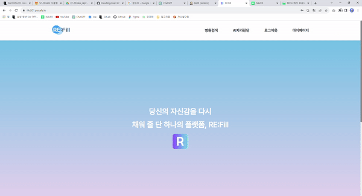
- 병원 검색

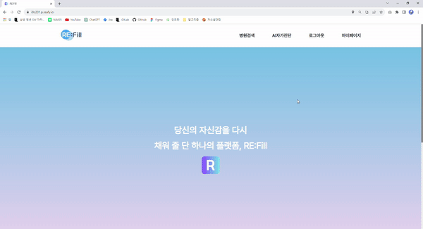
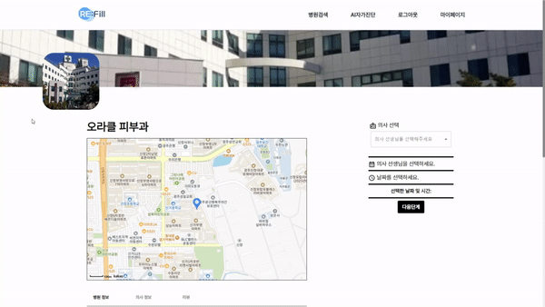
- 병원 예약

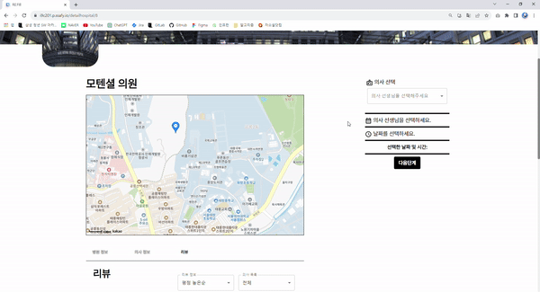
- 마이 페이지

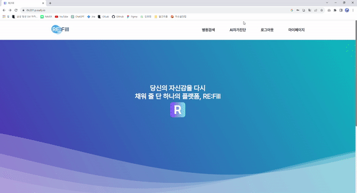
- 의사상담

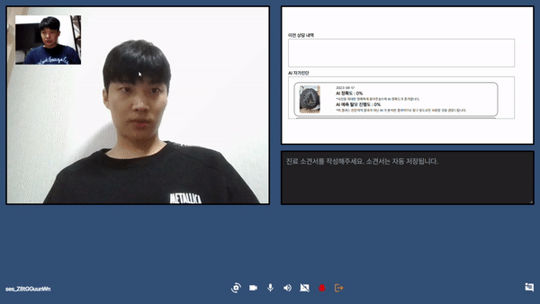

- 회원 상담

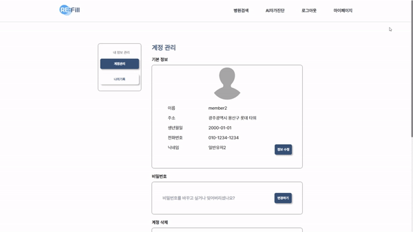

---

### 💾 ERD 💾

[자세히 보기](./exec/ERD/erd.md)

---

### ⌛ 요구 사항 정의서 ⌛

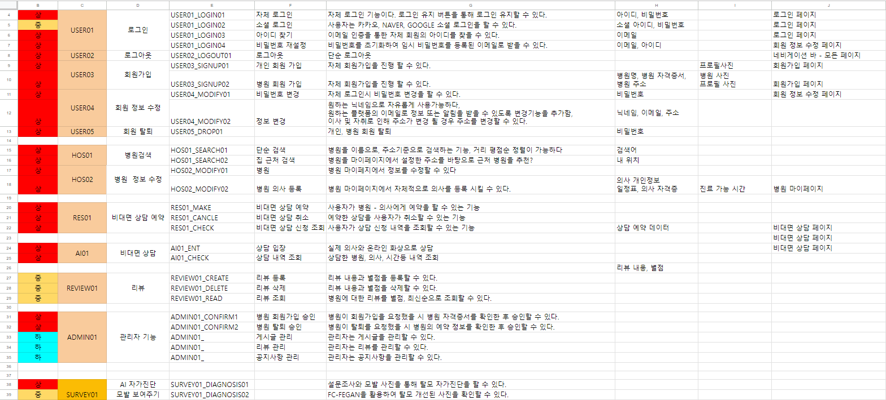
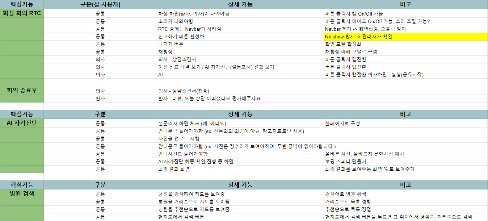
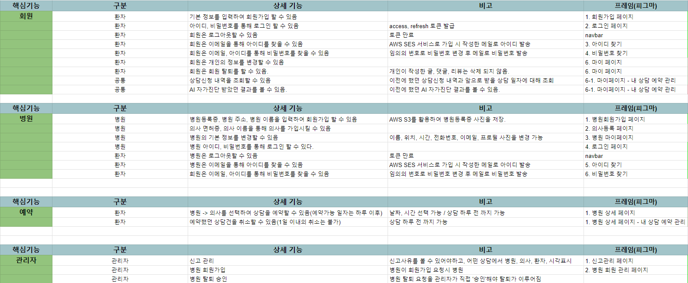

---

### 💎 와이어 프레임 💎

[자세히 보기](./exec/wireframe/wireframe.md)

---

### 🎀 API 명세 🎀
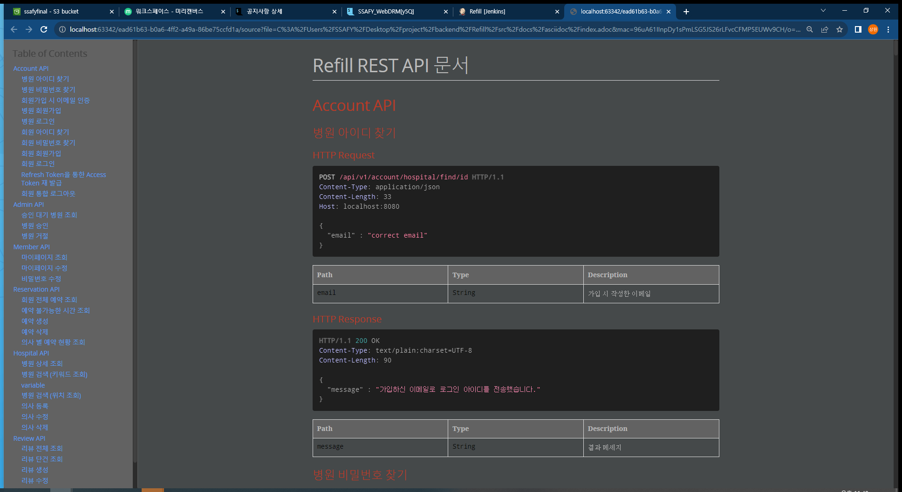

- 기존 Swagger가 아닌 REST docs를 활용하여 API 명세를 작성함.
- 운영 코드에 대한 침투 없이 API명세 작성 가능

---

### 🖥️ 개발 환경 🖥️

- BackEnd 🖥
    - Intellij IDE
    - Springboot
    - Spring Data JPA
    - Spring Security
    - QueryDSL
    - Redis
    - MariaDB
    - REST Docs
- FrontEnd 💻
    - VScode
    - React
    - Redux
    - Node.js
- AI 🛠
    - Flask
    - Teachable Machine
- CI/CD ⚙
    - AWS EC2
    - docker
    - Jenkins
    - Nginx
---
### 🔨 협업 툴 🔨

- **JIRA**
    - 상세한 일정 관리를 위해 JIRA를 사용했습니다. 매주 월요일 한 주동안 진행되어야 되는 내용에 대해 정리하고 일주일 단위로 스프린트를 작성했습니다. Epic, Story, Task를 명확히 구분해 계획을 세분화 하였습니다.
- **Notion**
    - 프로젝트에 공통적으로 진행되는 내용인 Git 컨벤션, 브랜치 전략, 요구사항 명세서, 공유하고 싶은 기술 내용등을 관리했습니다.
- **Scrum**
    - 매일 아침 Scrum을 진행하며, 개인별 진행된 사항과 진행할 사항에 대해 간단히 이야기하며 혹시 스프린트를 진행하는데 문제가 될 수 있는 사항에 미리 대처할 수 있었습니다.
---

### 🐕‍🦺 서비스 아키텍쳐 🐕‍🦺

---

### ✨ 기술 특이점 ✨

- **캐시의 적극적 사용**
    - Redis를 Access, Refresh Token만 보관하기는 잘 활용하지 못하는 것 같아 회원, 병원정보 등 자주 조회되는 정보에 대해서 캐싱을 적극 활용해 조회 쿼리를 줄임
- **Load Balancing사용**
    - AI 자가진단의 경우, 설문조사 결과와 이미지를 분석해 탈모의 정도 이에 대한 정확성을 반환하는데 요청이 많이 생길 경우 병목 현상이 발생할 수 있는 문제점이 있음. 이를 위해 AI 서버를 여러개 띄워 병목 현상을 해결함
- **AI 모델 학습**
    - Teachable Machine을 활용하여 자가진단을 위한 이미지가 탈모 진행도 판단을 위해 적절한 이미지인지 먼저 판별한 후, 직접 학습 시킨 모델을 바탕으로 탈모에 대한 진행도를 판별할 수 있도록 함
- **webRTC**
    - 단순한 화상 통화 뿐만 아니라, 화상 통화 중 화면 공유, 채팅, 환자 정보 조회 등 다중 컴포넌트화로 다양한 기능 제공
---
### 🏴󠁭󠁣󠁰󠁨󠁿 EC2 포트 정리 🏴󠁭󠁣󠁰󠁨󠁿

|**PORT**|**이름**|
|:---:|:---:|
|443|HTTPS|
|80|HTTP - HTTPS로 리다이렉트(프론트 페이지지로 리다이렉트)|
|8443|Openvidu|
|6377|Redis|
|3306|MySQL|
|8088|Jenkins|
|8090|Spring boot Docker Container|
|3000|React, NginX Docker Container|
|5000~5002|Flask AI server|

---

### 🐣 개인 회고 🐣
**신호인😊**: 싸피에 와서 처음으로 6명의 팀원들과 합을 맞춰 프로젝트를
진행하면서 과정 자체가 너무 즐거웠던것같습니다. 기획부터 개발, 배포까지 모든 과정들이 쉽진 않았지만 한명이아닌 6명이 함께하는 프로젝트였기 때문에 힘내서 달려올 수 있었던 것 같습니다.
각자 위치에서 다들 고생 많이한 것 같아 마음은 편치않지만 그래도 큰 위기없이 마무리까지 잘 하게 되어 감사할 따름입니다.
팀장의 위치에서 항상 팀원들을 격려하는 해결사 상원이형,
맏형으로 어려운 일이더라도 끝까지 해내는 든든한 재만이형
착실하고 성실하게 끈기있는 모습을 보여준 태성이형,
이제 CI/CD의 신이 된 규민이,
형들 할 일을 본인이 다 빠르게 쳐내주는 센스쟁이 승현이까지
너무 고맙고 행복했습니다!!!!

**이규민😋 :** 이제 드디어 1인분의 역할을 했다고 말할 수 있는 프로젝트가 생긴 것 같습니다. 처음 맡은 배포 였고 힘든 부분도 있었지만 모르는 부분을 공부해 하나씩 구축해 나갈수록 재미도 느낄수 있었습니다. 쿠버네티스의 오케스레이션등 활용해보고 싶은 기술도 있어 앞으로의 개발이 기대가 됩니다. 스프링부트 코드를 작성하는 것 역시 이제는 자바에 대한 정확한 이해를 필요로 한다는 것을 깨달았습니다.
6명으로 1학기에 진행한 2명에 비해 무려 3배나 많은 인원으로 전보다 더 많은 것을 하고 싶어 욕심을 부렸는데 팀원 모두 의욕을 가지고 적극적으로 참여해줘 프로젝트틀 성공적으로 마칠 수 있었습니다. 5명 모두에게 감사하다는 말을 드리고 싶네요~~😘😘😘

**김재만😀:** 저는 리더에는 어울리지 않는 사람이라는걸 느끼는 것 같습니다. 리더로써 부족한 역량과 줏대없는 기준으로 프론트엔드를 같이한 동료들에게 조금 미안한 마음이 들었습니다. 그래도 다들 열심히 해주어서 고마웠고 많은 실력이 향상 된 것 같아 보람도 있었습니다. 팀 프로젝트는 정말 대학교 때부터 가장 하기 싫었던 일 중 하나로 꼽혔었는데, 이번 팀 프로젝트를 계기로 조금 생각이 달라졌습니다. 물론 팀프로젝트를 하면서 힘든 일도 있었지만, 마지막이 된 지금 이 글을 쓰면서 돌아보니 별일 아니었던거 같고 당시 화가 나고 힘들어 했던 제 자신이 부끄럽습니다. 이상 팀 C201 프로젝트 RE:Fill 을 진행하면서 느낀 제 후기였습니다~~ 

**이태성😁 :** 각자가 맡은 역할을 책임감 있게 소화하다보니 저도 덩달아 열심히 하게 되었습니다. 처음 부터 재밌게 시작해서 끝날 때까지 즐거웠고 배울점이 많았던 시간이었습니다.처음 사용하는 프레임워크다 보니 익숙해지는데 한 주를 통채로 쓴 것 같습니다. 결국 Vue나 React나 비슷한 원리로 실행되는 것을 알았습니다. 하지만 Vue에 비해서 React의 store방식이 더 복잡해보였고 사용하기 까다로웠던 것 같습니다. 그러면서도 자유도가 높아서 코딩하는데 재밌었고 앞으로도 react를 더 공부해보고 싶습니다.React도 처음이고 JavaScript도 아직 초보수준인데 여기에 TypeScript까지 포함되서 매우 어려웠습니다. 하지만 사용하다보니 이젠 TypeScript를 사용하지 않으면 불편한 것 같다고 느껴집니다. 코드를 작성할 때부터 에러를 던져주기 때문에 잘못된 값으로 코드를 작성할 일이 적어졌습니다. 또한 어떤 값이 들어가는지 가시적이기 때문에 개발하는데 편했습니다. 꼭 사용하면 좋은 언어라고 생각합니다. 컨디션 조절은 필수입니다. 프로젝트 기간 동안 감기에 식중독에 많이 아팠던 것 같습니다. 잠도 제 때 자야할 때는 잤어야 했습니다. 무리해서 아픈 것 만큼 미련한 사람은 없지 않을까요. 아프지 않고 프로젝트를 잘 수행하는 것이 중요하다고 느꼈습니다.

**김승현😃 :** 첫 번째 프로젝트부터 좋은 팀원들과 같이 진행할 수 있어서 행복했습니다. React, Redux, TypeScript 모두 처음 써보는 기술들이라 프론트 팀원 모두 고생하면서 서로에게 지식 공유를 많이 해줌으로써 기술배경지식이 늘어났으며 또한 Back 팀원들과 꾸준한 소통 및 피드백을 나눔으로써 저희의 프로젝트를 성황리에 마칠 수 있어서 기쁩니다.  

**신상원😆 :** 제가 많이 부족했음에도 불구하고 너무 열정적으로 프로젝트에 임해주셔서 감사한 시간이었습니다.
앞으로 이렇게 열정적이고 의지있는 동료들과 같이 프로젝트를 할 수 있을지 모르겠습니다 ㅎㅎ
다시한번 감사합니다 !!

---
### 🐣 팀 회고 🐣
- 문서화는 미루지 말고 작성해야 하는 즉시 하기!!
- 개발자로써 건강 관리는 필수인걸 알게 되었습니다. 힘들더라도 몸 관리와 스트레칭을 습관화 하기!!
- 프론트끼리, 백끼리만 소통하는 것이 아니라 전체적으로 구성원 모두 프로젝트 진행 사항에 대해 알 수 있도록 소통 잘하기!!!
- 깃, JIRA, 회의록 등 컨벤션을 잘 지켜 모두가 보기 편하게 하기!!
